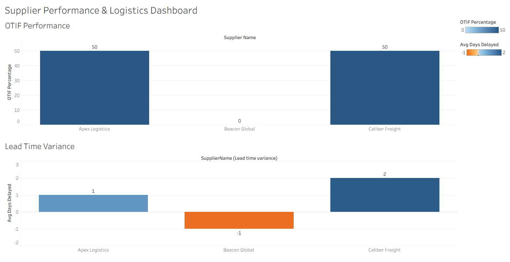

\# Supply Chain Performance \& Supplier OTIF Analysis

\## 📌 Project Overview

This project targets core distribution metrics by engineering a relational database system designed to track vendor compliance, analyze shipment fulfillment, and isolate operational logistics bottlenecks. 

\## ⚙️ Tech Stack \& Skills

\* \*\*Database Engine:\*\* SQL Server (T-SQL)

\* \*\*Concepts:\*\* Relational Database Architecture, Data Normalization, Multi-Table JOINs, Conditional Aggregations, Performance KPIs

\## 📊 Supply Chain Metrics Tracked

1\. \*\*On-Time In-Full (OTIF) Rate:\*\* Evaluates supplier compliance by measuring the exact percentage of shipments arriving on schedule with 100% quantity accuracy.

2\. \*\*Lead Time Variance:\*\* Isolates distribution delays by calculating the average variance between expected and actual delivery dates.

\## 📂 Repository Structure

\* `/sql\_scripts/schema.sql`: Contains the DDL script defining database tables (Suppliers, Products, Shipments) with robust primary and foreign key constraints.

\* `/sql\_scripts/queries.sql`: Features the analytical queries engineered for data extraction and business intelligence reporting.

## Executive Tableau Dashboard
An interactive dashboard tracking key vendor metrics including OTIF Percentage and Lead Time Variance:

